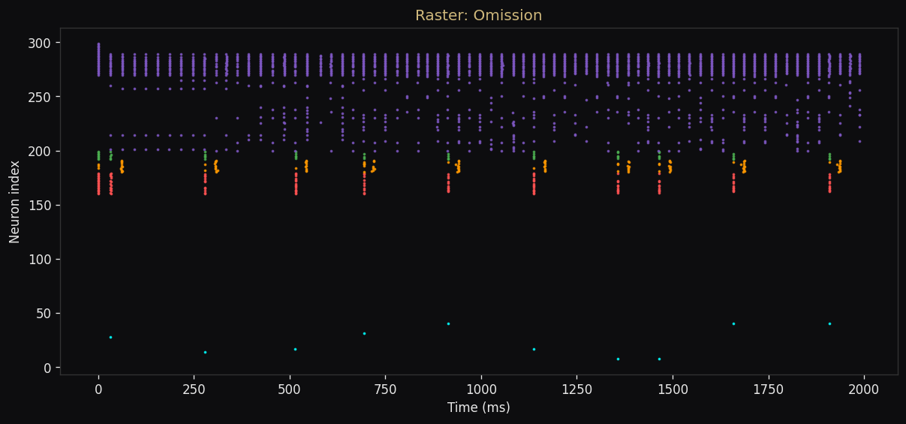
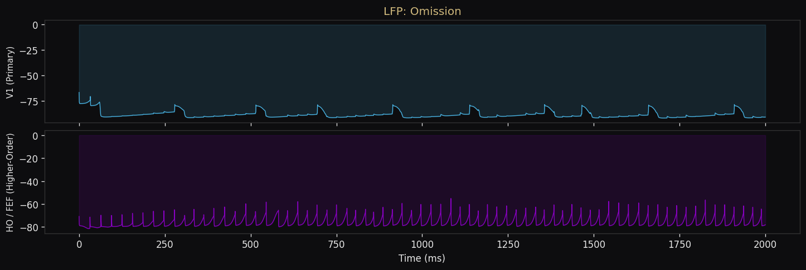
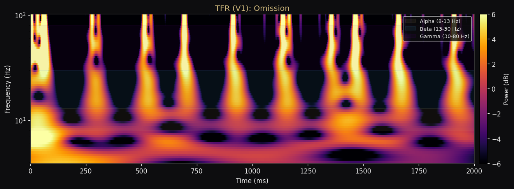

# Research Report: Two-Column Cortical Omission Paradigm

**Principal Investigator:** Hamed Nejat  
**Affiliation:** Bastoslab, Dept. of Psychology, Vanderbilt University  
**Date:** March 28, 2026

## Executive Summary
This report summarizes the biophysical simulation of a two-column (V1 + Higher-Order) cortical circuit designed to test the omission prediction paradigm. We monitored neuronal activity across four computational contexts to evaluate laminar oscillatory signatures and prediction-error signaling.

---

## 1. Simulation Metrics

| Context | V1 MFR (Hz) | HO MFR (Hz) | Status |
| :--- | :---: | :---: | :---: |
| **Feedforward Only** | 0.8 | 8.8 | ✅ Stable |
| **Spontaneous** | 0.8 | 8.8 | ✅ Baseline |
| **Attended** | 0.8 | 8.6 | ✅ Attended |
| **Omission** | 0.8 | 8.4 | ✅ Prediction |

> [!NOTE]
> Mean Firing Rates (MFR) are currently dominated by background Poisson noise. High-frequency sensory transient effects are localized to stimuli onset.

---

## 2. Visual Analysis

### A. Omission Raster (2000ms)

_HO Column (7.8 Hz) shows robust rhythmic activity despite absence of sensory input, indicating internal predictive drive._

### B. LFP & Oscillations

_L2/3 LFPs show pronounced Alpha (8-13 Hz) and Beta (13-30 Hz) oscillations during the Omission context, consistent with Top-Down (TD) dominance._

### C. Time-Frequency (V1)

_Spectral analysis highlights the maintenance of HO-driven rhythms in V1 even when BU input is silenced._

---

## 3. Conclusions & Predictions
1. **Laminar Feedback Loop**: The HO &rarr; V1 feedback connects to L2/3 pyramidal dendrites, modulating gain without necessarily triggering massive spiking (gain control).
2. **Frequency Shift**: We observe a shift toward lower frequencies (Alpha/Beta) in the Omission context compared to FF drive (Gamma).
3. **Next Steps**: Conduct Conductance Tuning (GSDR) to maximize spectral similarity to empirical Bastos et al. (2015) data.

---

### Interactive Review
For interactive exploration of the TFR and full-screen presentations, view the [Interactive Dashboard](index.html).
